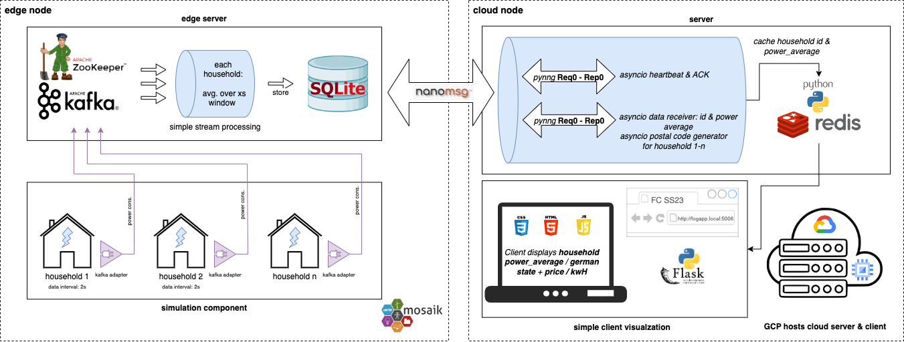

# fog-project



This project simulates a distributed power system where power data from
different households is streamed in real-time. The data is processed and
averaged over a 5-second window. The simulation is coordinated by Mosaik, a
co-simulation framework, and uses Apache Kafka for handling real-time data. The
averaged data gets queued into an SQLite database and arranged into a schema
that allows for the tracking of each inserted tuple. The edge server manages the
messaging of the queued data by continuously checking connectivity to the cloud
server and buffering the generated tuples into the sockets. The cloud server
caches each received tuple and generates the corresponding postal code for the
household, and sends this back to the edge server. The edge server eventually
stores this in its database and marks the tuple as acknowledged. The initial
start of the cloud server triggers a backend running on the same hosts that
fetches key-value pairs out of the cache and visualizes them on charts,
accessible on the web.

## Project Structure

```
.
├── cloud
│   └── tf_gcp_node
├── documents
└── edge
    ├── config.ini
    ├── data
    ├── docker-compose.yml
    ├── edge_server.py
    ├── main.py
    └── simulator
        ├── collector.py
        ├── household.py
        └── kafka_adapter.py
```

## Edge Component:

- `data`: Based on the original data from ["Gem House Opendata: German
  Electricity Consumption in Many Households Over Three Years 2018-2020 (Fresh
  Energy)"](https://ieee-dataport.org/node/4576/). The data is reduced to a one
  hour window and made compatible with the simulation environment by adding a
  title and converting the timestamp from `YYYY-MM-DD HH:mm:ss.SSS` to
  `YYYY-MM-DD HH:mm:ss`.

- `household.py`: Contains the `Household` simulator that generates power data
  based on the provided CSV file.

- `kafka_adapter.py`: Contains the `KafkaAdapter` and `KafkaAdapterModel`
  classes, responsible for connecting the Mosaik simulation with the Kafka data
  stream.

- `collector.py`: Contains the `Collector` simulator that collects all power
  data.

- `main.py`: Contains the main function for starting the simulation.

- `edge_server.py`: Contains the `EdgeServer` class for reading from and
  writing to Kafka topics.

- `edge_server.py`: Contains the `EdgeServer` class for reading, writing, and
  inserting the produced data from the Kafka topics into SQLite. Additionally,
  three concurrent threads are used to continuously check connectivity, publish
  data read from the Kafka topics and the SQLite database, and subscribe to
  messages from the cloud server. For messaging, we use Pynng, which is a
  Python wrapper of the lightweight, high-performance messaging library.
  Initially, it does not provide "reliable" features such as message buffering
  or connection retries. It is considered to be based on ZeroMQ but aims to
  simplify its usage.

- `db_operations`: The database contains operations for the lightweight,
  file-based SQLite database used by the `EdgeServer`. It creates a schema,
  inserts tuples received from the Kafka producer thread, and fetches newly
  inserted and lost data by tracking and checking the `sent` flag. Furthermore,
  it handles the insertion of messages received from the cloud server.

## Usage

1. Set up your Kafka and Zookeeper services. You can use Docker Compose with
   the provided `docker-compose.yml` file:

    ```
    docker-compose up -d
    ```

2. Configure the simulation parameters in the `config.ini` file, including the
   start and end time of the simulation, and the address of the Kafka server.

4. Create, activate a python virtual environment and install the requirements:

    ```
    python -m venv venv
    source venv/bin/activate
    pip install -r requirements.txt
    ```

3. Run the main Python script (after the server has started):

    ```
    python main.py
    ```

## Cloud Component

The cloud node runs the `cloud_server.py` file to interact asynchronously with
the edge component through three pynng sockets, utilizing both Pub/Sub and
Req/Rep message patterns. The cloud node subscribes to the data from the Kafka
server and caches the received data into a Redis cache. It also publishes the
generated postal codes to the edge server and triggers the `data_fetcher.py`
script in the backend to fetch data from the cache. This process provides a
RESTful API for an AJAX engine running `main.js` in the frontend. The cloud
server responds to continuous heartbeat messages to ensure necessary
reliability and handle disconnections in the event of network failures or
application crashes. The cloud server can be operated either directly or using
Docker with the provided Dockerfile.

- `cloud_server.py`: Contains asynchronous (implemented with asyncio & pynng)
  functions that reply to heartbeat messages by the edge-server, subscribing to
  the power data and publishing the generated postal codes back to the
  edge-server. The received data gets cached to redis-server instance on the
  same host.

- `data_fetcher.py`: Contains the flask backend script to fetch data out of the
  redis-cache, associate one of sixteen german states with the id of the
  received data tuple and providing a REST API for the frontend to present the
  data values on a webpage.

- `main.js + index.html + main.css`: Contains a simple frontend logic to access
  the key-value-pairs using ajax and implements a bar-chart of the `Chart.js`
  library to visualize the average power-consumption per german state in annual
  kw/h + the associated price based on an assumption.

### Usage

1. Follow the instructions in the `cloud/tf_gcp_node` directory to create a GCP
   node and connect to it. The server will start and install all dependencies
   on its own.

2. Start the cloud server application.

    ```
    cd /opt/server
    sudo python3 cloud-server
    ```

   This can be optionally automated by uncommenting the line

    ```
    # python3 cloud-server.py &
    ```

    in `cloud/tf_gcp_node/startup_script.sh`

4. Access the frontend via:

    ```
    http://<gcp_node_address>:5006
    ```
